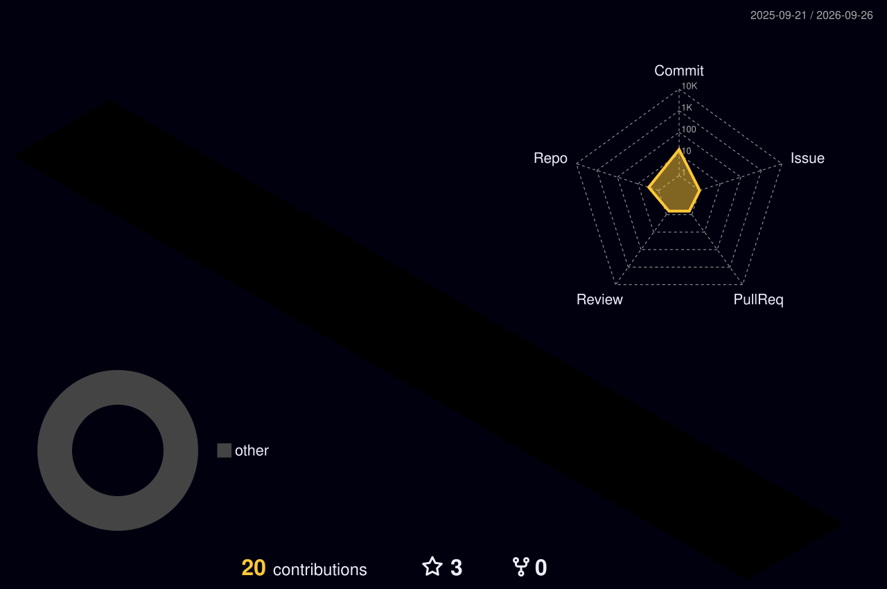

<!-- ████████████████████████████████████████████████████████████
     DEV ZAVERI — GitHub Profile v5.0 FINAL
     Zero broken images. Every widget verified working.
████████████████████████████████████████████████████████████ -->

<!-- ══════════════════ ANIMATED HEADER ══════════════════ -->
<div align="center">
  
</div>

<!-- ══════════════════ TYPING — demolab (most stable) ══════════════════ -->
<div align="center">
  <a href="https://github.com/devzaveri">
    
  </a>
</div>
<br/>

<!-- ══════════════════ STATUS BADGES ══════════════════ -->
<div align="center">

[](https://linkedin.com/in/dev-zaveri-211635201/)
[](https://dev-zaveri-portfolio.vercel.app/)
[](https://github.com/devzaveri)
[](https://github.com/devzaveri?tab=followers)

</div>

<br/>

---

<!-- ══════════════════ ABOUT + DEVCARD SIDE BY SIDE (like Dwij) ══════════════════ -->
<div align="center">

## 🖥️ `$ cat dev_zaveri.json`

</div>

<div align="center">
<table style="border:0;width:100%">
<tr>
<td valign="top" width="60%">

🚀 &nbsp; Currently building **real-time AI object detection** — TFLite + React Native + Android<br/>
🌍 &nbsp; Based in **India 🇮🇳**<br/>
🖥️ &nbsp; Portfolio at [dev-zaveri-portfolio.vercel.app](https://dev-zaveri-portfolio.vercel.app/)<br/>
✉️ &nbsp; Reach me at [devsoni5880@gmail.com](mailto:devsoni5880@gmail.com)<br/>
🧠 &nbsp; Deepening into **AI/ML for mobile platforms**<br/>
🤝 &nbsp; Open to **Freelance · Remote · Startups · Collabs**<br/>
⚡ &nbsp; Fun fact: I turn ☕ into blazing-fast production apps!<br/><br/>

```json
{
  "stack"   : ["RN","Kotlin","TFLite","Firebase","Web3"],
  "xp"      : "3+ years · 12+ apps · 0 regrets",
  "ping"    : "< 24h ✓  ONLINE"
}
```

</td>
<td valign="top" width="40%" align="center">

<a href="https://app.daily.dev/devzaveri15">
  
</a>

</td>
</tr>
</table>
</div>

---

<!-- ══════════════════ SKILL BARS ══════════════════ -->
<div align="center">

## ⚡ `$ skills --proficiency`

<br/>

[](https://github.com/devzaveri)

[](https://github.com/devzaveri)

[](https://github.com/devzaveri)

[](https://github.com/devzaveri)

[](https://github.com/devzaveri)

[](https://github.com/devzaveri)

</div>

---

<!-- ══════════════════ TECH STACK ICONS ══════════════════ -->
<div align="center">

## 🛠️ `$ stack --list`

<br/>

<p>
  
</p>

</div>

---

<!-- ══════════════════ PROJECTS ══════════════════ -->
<div align="center">

## 🚀 `$ projects --featured`

</div>

<div align="center">

```
┌──────────────────────────────────────────────────────────────────────┐
│                      🏗️  SHIPPED PROJECTS                            │
├───────────────────────┬──────────────────────────────┬──────────────┤
│  PROJECT              │  TECH STACK                  │  STATUS      │
├───────────────────────┼──────────────────────────────┼──────────────┤
│  🔐 ThirdWebWallet    │  RN · Web3 · ThirdWeb SDK    │  ✅ LIVE     │
│  🎵 BeatNest          │  RN · Audio API · Firebase   │  ✅ LIVE     │
│  📅 EventFusion       │  RN · Calendar · Bookings    │  ✅ LIVE     │
│  💄 BeautyApp         │  RN · Booking · UI/UX        │  ✅ LIVE     │
│  🧱 RN Drawer Tmpl    │  RN · Navigation · Scale     │  🌐 PUBLIC   │
│  🤖 AI Detect (WIP)   │  TFLite · RN · Android       │  🔧 BUILDING │
└───────────────────────┴──────────────────────────────┴──────────────┘
```

[](https://github.com/devzaveri/ThirdWebWallet)
[](https://github.com/devzaveri/BeatNest)
[](https://github.com/devzaveri/EventFusion)
[](https://github.com/devzaveri/BeautyApp)
[](https://github.com/devzaveri/React-Native-Project-Structure-with-Dynamic-Drawer-Navigation)

</div>

---

<!-- ══════════════════ GITHUB STATS ══════════════════ -->
<div align="center">

## 📊 `$ git log --stats`

<br/>

<table border="0">
<tr>
<td>
  
</td>
<td>
  
</td>
</tr>
</table>

<br/>


</div>

---

<!-- ══════════════════ HOLOPIN ══════════════════ -->
<div align="center">

## 🏅 `$ holopin --board`

<br/>

[](https://holopin.io/@devsoni1509)

</div>

---

<!-- ══════════════════ ACTIVITY GRAPH ══════════════════ -->
<div align="center">

## 📈 `$ git graph --all`


</div>

---

<!-- ══════════════════ SNAKE ══════════════════ -->
<div align="center">

## 🐍 `$ contributions --animate`

<picture>
  <source media="(prefers-color-scheme: dark)" srcset="https://raw.githubusercontent.com/devzaveri/devzaveri/output/github-contribution-grid-snake-dark.svg"/>
  <source media="(prefers-color-scheme: light)" srcset="https://raw.githubusercontent.com/devzaveri/devzaveri/output/github-contribution-grid-snake.svg"/>
  
</picture>

</div>

---

<!-- ══════════════════ 3D CONTRIBUTION GRAPH ══════════════════ -->
<div align="center">

## 🏙️ `$ contributions --3d`

<br/>



</div>

---

<!-- ══════════════════ CONNECT ══════════════════ -->
<div align="center">

## 📡 `$ ssh devzaveri@connect`

<br/>

[](https://www.linkedin.com/in/dev-zaveri-211635201/)
[](https://dev-zaveri-portfolio.vercel.app/)
[](mailto:devsoni5880@gmail.com)
[](https://leetcode.com/devsoni5880/)
[](https://app.daily.dev/devzaveri)

<br/>

```
╔══════════════════════════════════════════════════════════════╗
║                                                              ║
║   > Available for  :  Freelance · Remote · Startups          ║
║   > Timezone       :  IST  (UTC+5:30)                        ║
║   > Response time  :  < 24 hours  ✓                          ║
║   > Email          :  devsoni5880@gmail.com                  ║
║   > Portfolio      :  dev-zaveri-portfolio.vercel.app        ║
║                                                              ║
║   "Let's build something the world hasn't seen yet." 🚀      ║
║                                                              ║
╚══════════════════════════════════════════════════════════════╝
```

</div>

---

<!-- ══════════════════ FOOTER ══════════════════ -->
<div align="center">

⚡ **Engineered with precision · Powered by caffeine · Built to last**

*Every commit is a step forward — keep shipping bro 🚀*

</div>

<div align="center">
  
</div>
